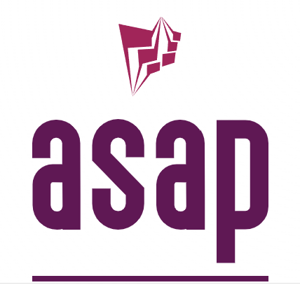

# Common submodule for the asap project



[](https://github.com/asap-projects/asap-common/actions/workflows/cmake-build.yml)

## [Project Documentation](https://asap-projects.github.io/asap-common/)

## Overview

This a header only library offering the most basic toolkit for multi-platform
and multi-compiler development for the asap projects. The module includes macros
and compiler definitions for platform and compiler feature detection as well as
some other preprocessor helpers. For a full documentation of what is available
refer to the [project docs](https://asap-projects.github.io/asap-common/).

## Getting the code

```bash
git clone --recurse-submodules -j4 https://github.com/asap-projects/asap-common.git
```

NOTES:

- -j4 requests git to parallelize cloning of repos. Needs a relatively recent
  version of git. If that is not available, simply do not use this option.

## Requirements

Make sure you have a C++ compiler with C++-17 capabilities at least. Gnu, Clang
and MSVC all can do that with a recent version.

## Enabling husky/commitlint/standard-version

Only one time after the project is cloned, do the following:

```bash
npx husky install
npm install -g @commitlint/cli @commitlint/config-conventional
npm install -g standard-version
```

## Building

```bash
mkdir _build && cd _build && cmake .. && cmake --build .
```

or just use one of the predefined `CMake` presets. Detailed instructions and
many useful commands are listed
[here](https://abdes.github.io/asap/master/html/01-getting-started/useful-commands.html).

### CMake configurable build options

```cmake
# Project options
option(BUILD_SHARED_LIBS        "Build shared instead of static libraries."              ON)
option(ASAP_BUILD_TESTS         "Build tests."                                           OFF)
option(ASAP_BUILD_EXAMPLES      "Build examples."                                        OFF)
option(ASAP_WITH_GOOGLE_ASAN    "Instrument code with address sanitizer"                 OFF)
option(ASAP_WITH_GOOGLE_UBSAN   "Instrument code with undefined behavior sanitizer"      OFF)
option(ASAP_WITH_GOOGLE_TSAN    "Instrument code with thread sanitizer"                  OFF)
option(ASAP_WITH_VALGRIND       "Builds targets with valgrind profilers added"           OFF)
```
